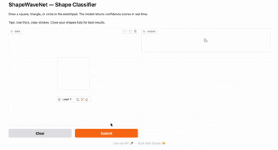

# 🔷 ShapeWaveNet — Hand-Drawn Shape Classifier

A PyTorch CNN that classifies hand-drawn shapes — **squares**, **triangles**, and **circles** — in real time via an interactive Gradio sketchpad interface.

---

## 🚀 Live Demo


**Try it here:** [Hugging Face Spaces - ShapeWaveNet](https://huggingface.co/spaces/eylonhotam/shapes-neural-network)

---

## Project Structure

```
shapes-neural-network/
├── model.py    # ShapeWaveNet CNN architecture
├── train.py    # Google Quick, Draw access, training loop, model saving
├── app.py      # Gradio inference UI with temperature scaling
├── requirements.txt      
└── README.md
```

---

## How It Works

**`train.py`** accesses 15,000 images of each class from the Google Quick, Draw dataset. The model trains for 30 epochs with an 80/20 train/val split and saves weights to `shapewavenet.pth` when done.

**`model.py`** defines `ShapeWaveNet`, a lightweight two-block CNN with dropout regularization that outputs logits over three classes.

**`app.py`** loads the saved weights and launches a Gradio sketchpad. It preprocesses your drawing (grayscale → resize → invert if needed → normalize), runs inference with temperature scaling to reduce overconfidence, and returns confidence scores for all three classes in real time.

---
## Key Design Decisions

| Choice | Reason |
|---|---|
| Google Quick Draw Dataset | Accesses and trains off the world's largest doodle dataset |
| DataLoader with `shuffle=True` | Prevents the model from memorizing class order |
| 80/20 train/val split | Tracks generalization throughout training |
| Dropout at 0.25 + 0.50 | Regularization in both the feature extractor and classifier heads |
| `CrossEntropyLoss` on raw logits | Numerically stable; Softmax is only applied at inference time |
| Grayscale inversion at inference | Normalizes sketchpad output (dark drawing on white) to match training format (white on black) |

---


## Model Architecture — `ShapeWaveNet`

```
Input (1×64×64)
  → Conv2d(1→16, 3×3) + ReLU + MaxPool2d(2×2)   → [16×32×32]
  → Conv2d(16→32, 3×3) + ReLU + MaxPool2d(2×2)  → [32×16×16]
  → Dropout(0.25)
  → Flatten → Linear(8192→128) + ReLU
  → Dropout(0.50)
  → Linear(128→3)
Output: [Square | Triangle | Circle]
```

---

## Getting Started

### Prerequisites

- Python 3.8+
- CUDA GPU optional — CPU works fine for both training and inference

### Installation

```bash
git clone https://github.com/eylonhotam/shapes-neural-network.git
cd shapes-neural-network
pip install torch torchvision opencv-python gradio numpy
```

### Train

```bash
python train.py
```

This generates synthetic data, trains for 50 epochs, and saves `shapewavenet.pth`. Loss and validation accuracy are printed every 10 epochs.

### Run the App

```bash
python app.py
```

Opens a Gradio interface in your browser. Draw a shape and see live confidence scores.

---

## Configuration

Key hyperparameters are defined at the top of each file for easy tuning:

**`train.py`**
| Variable | Default | Description |
|---|---|---|
| `NUM_SAMPLES` | `45000` | Total images accessed and trained off |
| `BATCH_SIZE` | `64` | Training batch size |
| `EPOCHS` | `50` | Number of training epochs |
| `LEARNING_RATE` | `0.001` | Adam optimizer learning rate |
| `VAL_SPLIT` | `0.8` | Fraction of data used for training |
| `SAVE_PATH` | `shapewavenet.pth` | Output path for saved weights |

**`app.py`**
| Variable | Default | Description |
|---|---|---|
| `WEIGHTS_PATH` | `shapewavenet.pth` | Path to trained model weights |
| `TEMPERATURE` | `2.0` | Softmax temperature — higher = softer, less overconfident predictions |

---

## Usage Tips

- Draw with **thin, clear strokes** — the model was trained on outline-style shapes, not filled ones.
- **Close your shapes fully** — open corners on squares or triangles can confuse the classifier.
- The app auto-inverts your drawing if it detects a white background, to match the training format (white shapes on black).
- If the margin between the top two predictions is under 0.2, the app will log a warning that the drawing may be ambiguous — try redrawing more deliberately.

---

## Roadmap / Future Steps

- [x] **`requirements.txt`** — pin dependency versions for reproducible installs
- [x] **Hugging Face Spaces deployment** — host the Gradio app publicly without needing a local tunnel 
- [x] **Real dataset support** — integrate Google Quick, Draw! data to improve robustness on actual handwriting
- [ ] **Add more shape classes** — pentagon, star, arrow, cross
- [ ] **Per-class accuracy logging** — add a confusion matrix at the end of training to identify which shape is hardest to classify
- [ ] **Learning rate scheduler** — experiment with `CosineAnnealingLR` or `ReduceLROnPlateau` for better convergence


---


## Built With

[PyTorch](https://pytorch.org/) · [OpenCV](https://opencv.org/) · [Gradio](https://gradio.app/) · [NumPy](https://numpy.org/)
